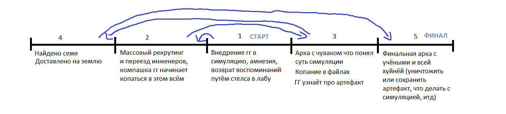

### Локация: 
- США, где-то в не очень далёком будущем (допустим 2032)

### Сюжет:
- Очередная экспедиция на Марсе находит следы ранее существующих форм жизни. Зонд находит место по типу архива, в котором находится семя истории этой нации. Офк, этот артефакт привозят на землю для анализа, но в новостях об этом ни слова.
- Само семя это по факту сид для симуляции мира, который является историей всей марсианской цивилизации. Таким образом можно сохранить всю историю в очень компактном пакете, но для воспроизведения требуются нереальные вычислительные мощности. Такой подход также является эдакой защитой от идиота, дабы другие формы жизни с низким уровнем технологий случайно не воспроизвели эту историю и не получили технологии, таким образом получив преимущество над другими видами/нациями (чтобы по факту не получилась макака с гранатой/ядерный кризис v2). 
- Сразу после привоза семя учёные начинают реверс-инженерить артефакт, заодно массово рекрутируя инженеров и программистов для расчёта нужных симуляций. Конечно, рекрутят тупо для всяких симуляций, не упоминая ни слова о артефакте.
- Группа пиздюков которым нехуй делать (по совместительству компашка главного героя) замечает массовый рекрутинг и переезд инженеров, и по сарафанному радио они узнают что там будут проводить какие-то йоба симуляции всего и вся, но про сам артефакт ещё не знают. Конечно, всё это дело максимально питает их любопытство, так что они решают виртуально заглянуть под капот.
- Дальше можно продолжить по примеру прежних доков: в симуляцию внедряют сознание одного из агентов (2032 год, хули), но в процессе загрузки инет отрубают, так что подкинутое сознание буквально оказывается человеком с амнезией. Это сознание подкидывают рандомному (или нет, тут уже как хотите) жителю симуляции, формируя дуэт по типу Ви/Сильверхэнд. Так как симуляцию скинули с рельс вводом новой неизвестной в виде этого чувака, то всё что после этого происходит на самом деле не произошло на марсе, так что можно хуярить по полной и не волноваться о каких-либо несостыковках марса в ирл и того что в симуляции (хоть BFG 10K ебашьте).
- Главному герою возвращают воспоминания и тот вспоминает про симуляцию. Можно подкинуть мелкий флешбек который объясняет мотивацию гг (какая нахуй мотивация у малолетних дебилов, лул) и то как он тут оказался. Начинается активное копание в файлах и симуляции.
- Вполне можно добавить арку с чуваком который понимает что это всё симуляция и в процессе получает буквально godmode. Также можно добавить концепт оружий что юзают баги в системе.
- ГГ узнаёт про семя (опять можно подкинуть флешбек) и тут перед ними встаёт ебать какая дилемма: людям нельзя дать в руки такую инфу, ибо через воспроизведение симуляции они смогут получить доступ к оружию охуеть какой силы, по факту вернув ядерный кризис. С другой стороны, можно получить доступ к технологиям которые помогут развитию всего человечества, возможно создав новые источники энергии и таким образом спасая экологию планеты (ибо я ебать как сомневаюсь что за 10 лет всё внезапно станет лучше на этом фронте). По факту получается диллема Эйнштейна, который создал ядерное оружие желая просто создать новый источник энергии, но с оговоркой на то что мы знаем про возможные военные применения технологий. Также поднимается вопрос с жителями симуляции, ибо хоть это и иные формы жизни, но это точно такие же живые существа с эмоциями, мыслями и желаниями, и выключение симуляции их тупо убьёт (хоть и безболезненно), так что тут тоже можно чото придумать.

### Таймлайн:

Стрелки это флешбеки и возвраты для объяснения всей истории

### Про марсиан

- Дабы сильно не ебаться с ворлдбилдингом иноземной цивилизации для игры на 7 часов можно тупо сделать марсиан похожими на людей, только с несколькими изменениями в анатомии (дополнительная пара рук, отрубленные пальцы, лишние глаза). Сами действия симуляции могут проходить тупо в городской среде, дабы можно было во-первых подкинуть достаточно поводов для экшона (как пример для такого можно взять katana zero) и во-вторых забить весь фон кучей отсылок и мемасов ([] > #, обязательная отсылка на гачи ну и прочее). Ну и для особо душных что будут давиться с того что в игре просто так воссоздан человеческий город можно тупо скинуть объяснение на отъебись а-ля "нейронные сети симуляции были натренированы в человеческой среде, вот вам и такая схожесть"

### Персонажи

- ворк ин прогресс