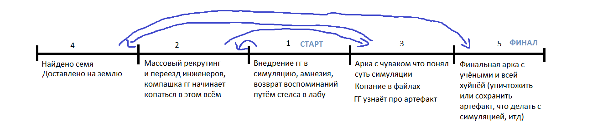

### Локация: 
- США, где-то в не очень далёком будущем (допустим 2032)

### Сюжет:
- Очередная экспедиция на Марсе находит следы ранее существующих форм жизни. Зонд находит место по типу архива, в котором находится семя истории этой нации. Офк, этот артефакт привозят на землю для анализа, но в новостях об этом ни слова.
- Само семя это по факту сид для симуляции мира, который является историей всей марсианской цивилизации. Таким образом можно сохранить всю историю в очень компактном пакете, но для воспроизведения требуются нереальные вычислительные мощности. Такой подход также является эдакой защитой от идиота, дабы другие формы жизни с низким уровнем технологий случайно не воспроизвели эту историю и не получили технологии, таким образом получив преимущество над другими видами/нациями (чтобы по факту не получилась макака с гранатой/ядерный кризис v2). 
- Сразу после привоза семя учёные начинают реверс-инженерить артефакт, заодно массово рекрутируя инженеров и программистов для расчёта нужных симуляций. Конечно, рекрутят тупо для всяких симуляций, не упоминая ни слова о артефакте.
- Группа пиздюков которым нехуй делать (по совместительству компашка главного героя) замечает массовый рекрутинг и переезд инженеров, и по сарафанному радио они узнают что там будут проводить какие-то йоба симуляции всего и вся, но про сам артефакт ещё не знают. Конечно, всё это дело максимально питает их любопытство, так что они решают виртуально заглянуть под капот.
- Дальше можно продолжить по примеру прежних доков: в симуляцию внедряют сознание одного из агентов (2032 год, хули), но в процессе загрузки инет отрубают, так что подкинутое сознание буквально оказывается человеком с амнезией. Это сознание подкидывают рандомному (или нет, тут уже как хотите) жителю симуляции, формируя дуэт по типу Ви/Сильверхэнд. Так как симуляцию скинули с рельс вводом новой неизвестной в виде этого чувака, то всё что после этого происходит на самом деле не произошло на марсе, так что можно хуярить по полной и не волноваться о каких-либо несостыковках марса в ирл и того что в симуляции (хоть BFG 10K ебашьте).
- При передаче сознания оказывается что оно оп факту разрубилось на две половины, одна из которых является гг, а вторая попалась соулкиллеру. Соулкиллер это чувак который явно копался в симуляции, но в итоге использовал сознания нынешних жителей для создания оружий с "душой". Его заебал новомодный тренд на использование ультра лёгких материалов для улучшения пушки, и считает что оружие должно дополнять своего владельца, по такой логике идеальное оружие по факту не подходя никому. Своё оружие же не только хорошо работает в тандеме с верным владельцем, но и само меняет свою траекторию и даёт дополнительные эффекты при атаках (буквально sword art-ы из elden ring), но владельца надо сначала подобрать, иначе оно работать ну никак не будет. Знаком того что "тот самый" человек нашёлся это то что оружие буквально левитирует рядом с ним (как мечи рамлеталь из GGST). Сами души же соулкиллер собирает с помощью кастомных дополнений на свои пушки, что по факту сохраняет дамп сознания цели за моменты до смерти, и потом трансфьюзит их в оружие (то есть цель по факту жива, но вот только в форме оружия). Ну и конечно, для сбора душ тот регулярно рубит всяких неудачливых человечков в подворотнях и оставляет кастомный знак "die to live forever" (ну или можно придумать чото менее кринжовое, я хз). Когда соулкиллеру попадается половина сознания гг, тот ещё больше начинает шизить по своей теме с душами так как он оказался частично прав, и душу вполне можно отделить от тела. Ещё он замечает что душа гг ебать как отличается от остальных, так как у неё есть потенциал создать пушку кардинально отличающаяся от остальных. В итоге тот рубит один из своих глаз пока гг частично контролирует тело дабы словить душу, и перекидывает её в гибридный двуручник, который начинает юзать как основное оружие, хоть тот и не сильно слушается его (прежним мейном была катана и вакидзаси (билд Okina из elden ring)), и дальше идёт рубить ещё больше народу на души.
- По всяким причинам, гг и хост идут исследовать места убийств соулкиллера (хост оказался ментом и ему надо анализировать всю фигню, хост крышевал компашку которая оказалась мясцом для соулкиллера), в итоге сами чуть не став мяском (можно сделать это как ебать какой сложный боссфайт что нереально победить). Соулкиллер замечает что 
двуруч как-то странно реагирует на хоста с гг, но в итоге его гоняют ссаными тряпками и гг чудом остаётся живым.
- Надо подкинуть какого-либо геймплейного движа тут, ибо соулкиллера тут чёт дохуя.
- Главному герою возвращают воспоминания и тот вспоминает про симуляцию. Можно подкинуть мелкий флешбек который объясняет мотивацию гг (какая нахуй мотивация у малолетних дебилов, лул) и то как он тут оказался. Также соулкиллер жопой чует факт перекидывания данных, так как они дошли и до половины души из двуруча, и тот начинает охотиться за гг.
- Начинается битва с соулкиллером, тот тянет гг на свои башни где тот (и по факту вся его семья) ковал оружие. В своей первой фазе тот пользуется двуручем, но то явно не слушается соулкиллера, явно видя что его используют против себя же. В конце первой фазы гг сбивает двуруч у соулкиллера и поясняет за то что чел ебать как долго пиздел про синергию оружия и владельца, а самого-то пушка не слушается. В итоге босс берёт свою сигнатурную катану что содержит часть его же души, а башни начинают подниматься вверх. В конце этой фазы гг разрубает к хуям мост, сбивает босса и рубит его на кусочки при падении вниз между башнями (удобно так как есть дэш и прыжок со стены), в итоге вонзав меч в тело соулкиллера при контакте с землёй и украв его душу двуручем.

- ГГ узнаёт про семя (опять можно подкинуть флешбек) и тут перед ними встаёт ебать какая дилемма: людям нельзя дать в руки такую инфу, ибо через воспроизведение симуляции они смогут получить доступ к оружию охуеть какой силы, по факту вернув ядерный кризис. С другой стороны, можно получить доступ к технологиям которые помогут развитию всего человечества, возможно создав новые источники энергии и таким образом спасая экологию планеты (ибо я ебать как сомневаюсь что за 10 лет всё внезапно станет лучше на этом фронте). По факту получается диллема Эйнштейна, который создал ядерное оружие желая просто создать новый источник энергии, но с оговоркой на то что мы знаем про возможные военные применения технологий. Также поднимается вопрос с жителями симуляции, ибо хоть это и иные формы жизни, но это точно такие же живые существа с эмоциями, мыслями и желаниями, и выключение симуляции их тупо убьёт (хоть и безболезненно), так что тут тоже можно чото придумать.
- Дабы подлить бензина в огонь (и гарантировать релиз ещё более ёбнутого сиквела), пиздюки решают не уничтожить или спрятать артефакт, а наоборот, опубликовать все его данные в открытый доступ. Таким образом у каждого есть доступ к инфе, и таким образом ядерный кризис не повторится.
    - И так блять, что надо делать с этой фиговиной? Не возвращать же её нашему любимому государству?
    - Ага, надо же как-то этой железкой отбить раздолбанный грузовик.
    - С одной стороны, там находятся чертежи гравидвижка, фотонного отвердителя и источника энергии намного эффективнее и экологичнее наших, не говоря уже о наработках в медицине и биоинженерии.
    - А с другой - оружейные наработки всех сортов и расцветок. Я даже не говорю о их варианте термояда, одних стволов что не требуют патронов хватит чтобы уничтожить вид homo sapiens.
    - Хмммм...
    - ...
    - Сука, сука, СУКА, они отрубили доступ к серверу пока я удалял их базы данных.
    - И чё это значит?
    - Если кардинально не уничтожить носитель то данные всегда можно восстановить.
    - То есть через пару месяцев те чуваки из лабы опять возьмутся за этот проект?
    - Они буквально продолжут работу с последнего бэкапа, им даже сид не нужен.
    - То есть по факту данные уже есть у кого-то.
    - ...
    - А знаете что ещё можно сделать?
    - Ты думаешь что сейчас можно как-то удалить те данные? Я в эту дыру лезть не буду, одного раза хватило за глаза.
    - Не, фиг с их данными, а что будет если мы предоставим доступ к железке всему миру?
    - Ну ты совсем ёбнутый, это то же самое что и распространить сиквел поварёной книги анархиста, добра точно ждать не стоит.
    - Зато таким образом избежим ядерный кризис, не будет лишь наше государство владеть такими пушками, ВЕСЬ МИР будет владеть ими!
    - Да ты ёбнутый.
    - Ну а что по-твоему лучше, ждать пока наши учёные реверс-инженернут все наработки с железок и начнут войну со всеми? Уж если даёшь кому-то ружьё то отдай каждому.
    - Ну доля смысла в этом есть, распространяя данные мы просто выберем лучший вариант из доступных.
    - Да тут очевидная аксиома Эскобара, есть смысл разве что заранее готовиться к пиздецу и прятаться в бункере.
    - Ну чё тогда, заливаем инфу на самый надёжный форум (конечно же 4chan).
    - Ясно, значит грузовик я свой не верну.

### Таймлайн:

Стрелки это флешбеки и возвраты для объяснения всей истории

### Про марсиан

- Дабы сильно не ебаться с ворлдбилдингом иноземной цивилизации для игры на 7 часов можно тупо сделать марсиан похожими на людей, только с несколькими изменениями в анатомии (дополнительная пара рук, отрубленные пальцы, лишние глаза). Сами действия симуляции могут проходить тупо в городской среде, дабы можно было во-первых подкинуть достаточно поводов для экшона (как пример для такого можно взять katana zero) и во-вторых забить весь фон кучей отсылок и мемасов ([] > #, обязательная отсылка на гачи ну и прочее). Ну и для особо душных что будут давиться с того что в игре просто так воссоздан человеческий город можно тупо скинуть объяснение на отъебись а-ля "нейронные сети симуляции были натренированы в человеческой среде, вот вам и такая схожесть"

### Персонажи

- ворк ин прогресс